#How to Apply for a Distribution Certificate and Use Code IDE to Make A Distributable ipa

## 1. Steps

- **Add distribution certificates**
- **Add App ID**
- **Add distribution provisioning profile**
- **Use Code IDE to compile and pack a distribution ipa**

###Note: The application process of a distribution certificate is very similiar to that of a developer certificate; so all you need is to regenerate the distribution certificate and provisioning profile

## 2. The Instructions About iOS Distribution Version

#####1. Distribution Certificates: Apple authorized certification for developers;Unlike Development Certificates, distribution certificates can only be used to distribute and not for real device debugging.

#####2. App ID: All Apps have to have a App ID before releasing. It's the one and only valid identification of Apple that usually requires of a Product name and Bundle ID.

#####Note that Bundle ID is a reverse DNS string. For example: com.company.name; it contains information of the developer and the application. The name section can be specified as the name of a single application or of multiple applications; if former, fill in the app name to the name section as the mentioned example; if latter, name section can be substituted with "*". However, Bundle IDs with "\*" would be unable to use a few features such as pushing.

#####3. Distribution Provisioning Profile: containing certificate and App ID. The difference between distribution provisioning profile and development provisioning profile is that the former does not contain the information such as UDID of the device.

## 3. Add Distribution Certificates

#####First，we need to enter [Apple Developer Center](http://developer.apple.com)，click the MemberCenter and login(of course you'll need a iOS Developer account) into where shown in the picture

#####Select the Certificates option
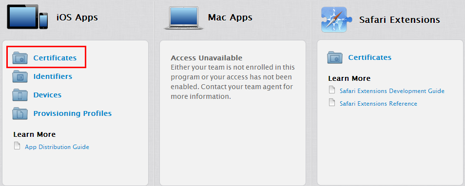

#####Then, We will find a sub-option named "production" under "Certificates，" please select it
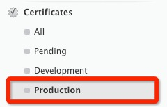

#####Click the small plus icon at the right side of the page; select App Store and Ad Hoc and click continue
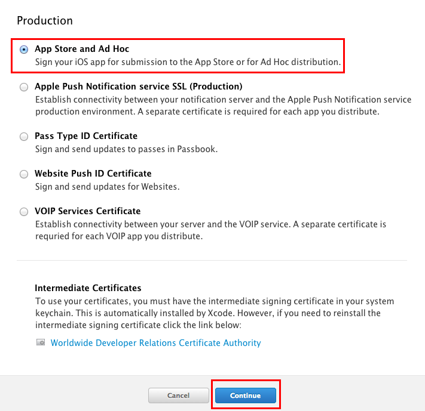

#####It means that we must create a CSR file on our Mac to create the distribution certificate. Next we're conducting this series of operations.
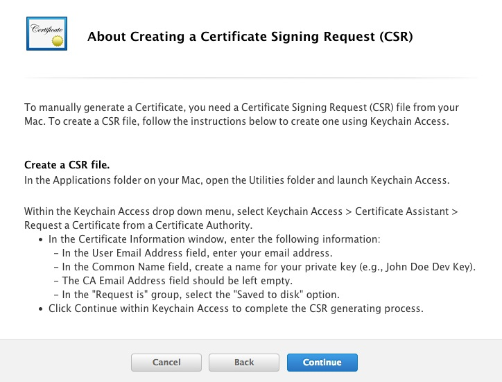

#####Under Applications/Utility，there is a keychain access tool that can help us create a CSR file with ease

#####Open it，click the keychain access menu and select “Certificates Assistant/Request a Certificate From Authority”

#####Then, we need to enter user's email address and common name. Note that there are two ways of saving, and under usual circumstance we'd save to the disk. Then click the continue button

#####Leave at the default settings and keep going

#####Now，the CSR file we need is created; next let's go back to the certificate creating.
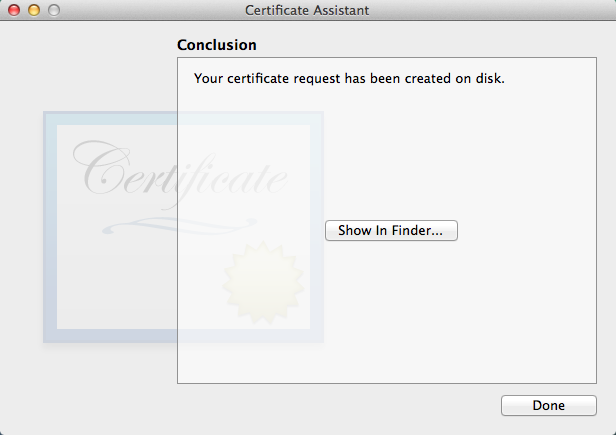

#####Back to developer center website and click continue, you'll see the screen as below. Click “Choose File” to select the CSR file we created just now. Then, click "Generate."
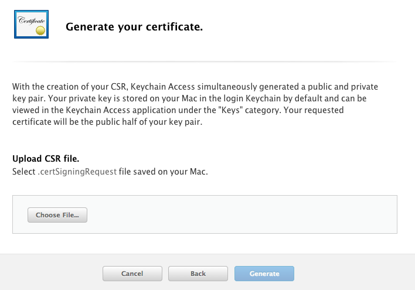

#####Wait for seconds and you should be notified that certificate is created successfully. Click "Done" and download it.
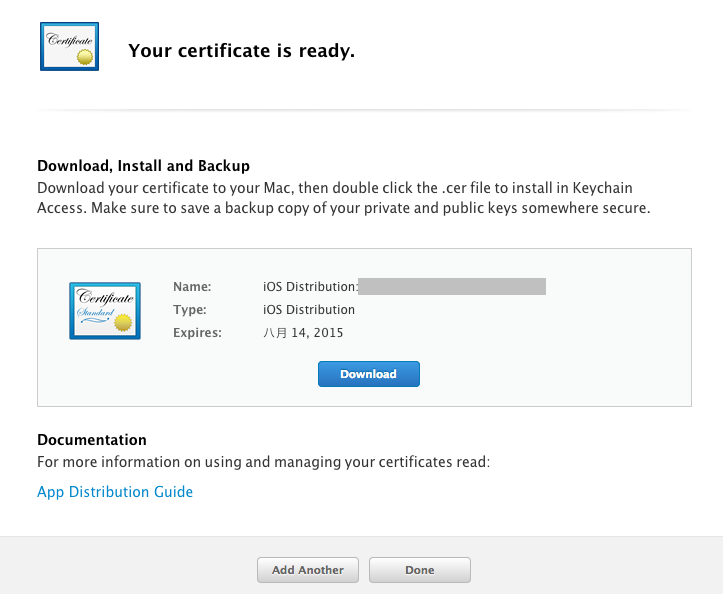

#####Double click the Certificate file and the secret key would automatically be added to the keychain; also, there would be a small triangular arrow at the certificate and if you click it, you'll see a subitem with a key-shaped icon. That means we've successfully created the certificate.  
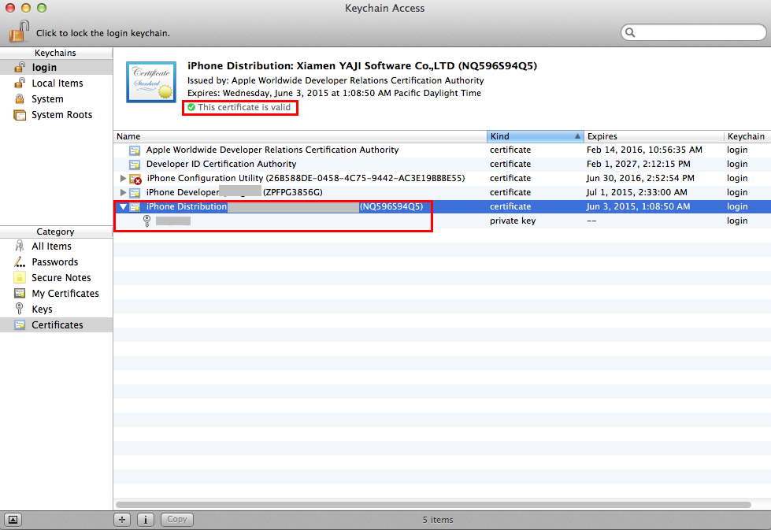

## 5. Add App ID

#####To create a distribution provisioning profile we need a valid App ID first; if you already have one you can skip this step.

#####Click Identifiers/App ID and click the plus button to create a new App ID
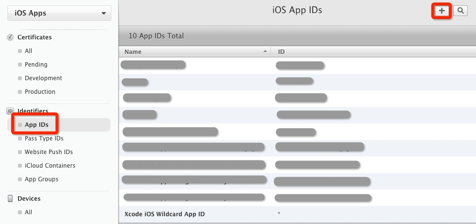

#####Enter its name

#####Next fill in its Bundle ID. Choose Wilcard App ID; the format usually goes like com.company.*, and you fill the middle with the company name. It is rather convenient but the thing is an App ID like this would not be able to use features like in-app purchase, pushing, Gamecenter, etc. Of course you can choose Explicit App ID，then you need to specify the Bundle ID without any usage of "\*." Choose what fits you the best.
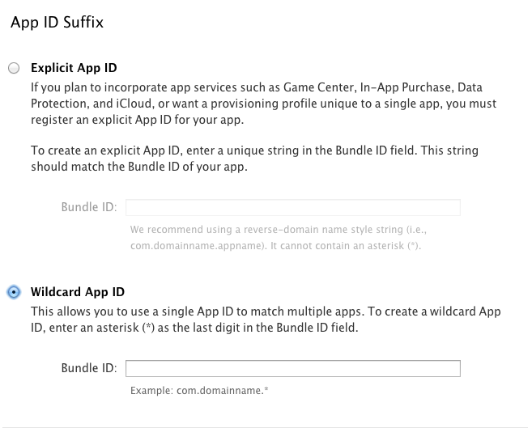

#####Click Submit button and finish the App ID creating process.
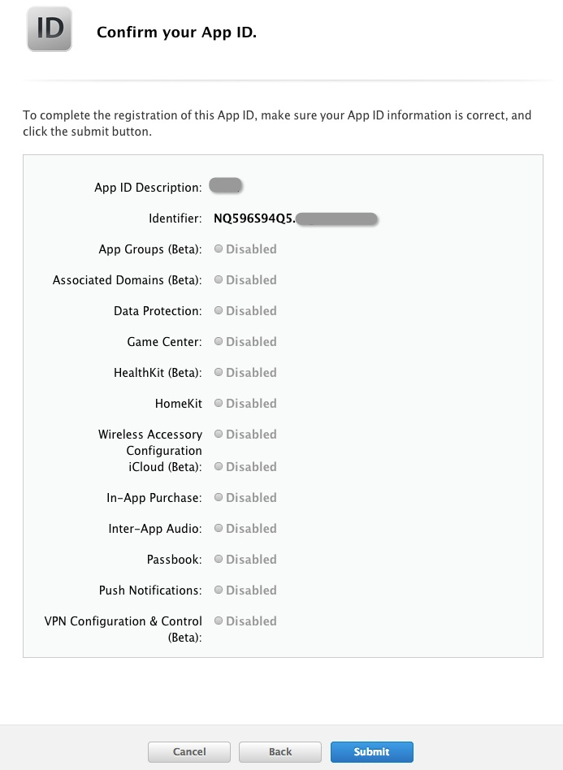

## 6. Add Distribution Provisioning Profile

#####Select The Provisioning Profiles/Distribution. Click the plus button.
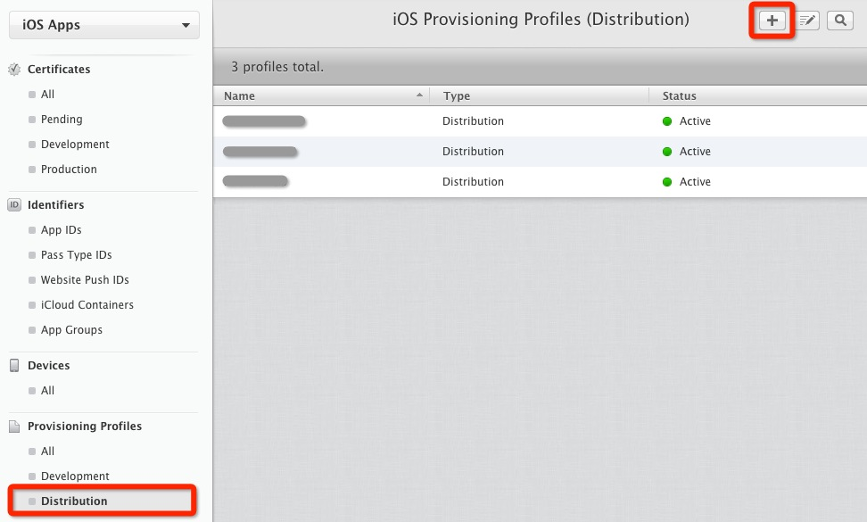

#####Select App Store and then Continue
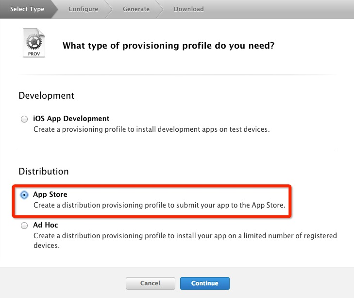

#####Choose the App ID we created just now

#####All available Distribution Certificates would be listed and select the one we created just now
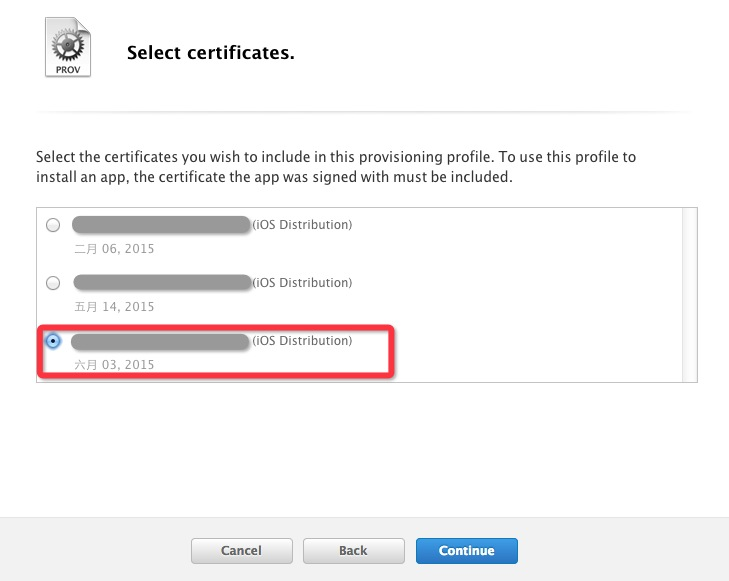

#####Fill in the configrution name and click "Generate"

#####Wait for seconds and you'll be notified that the distribution provisioning profile is created.
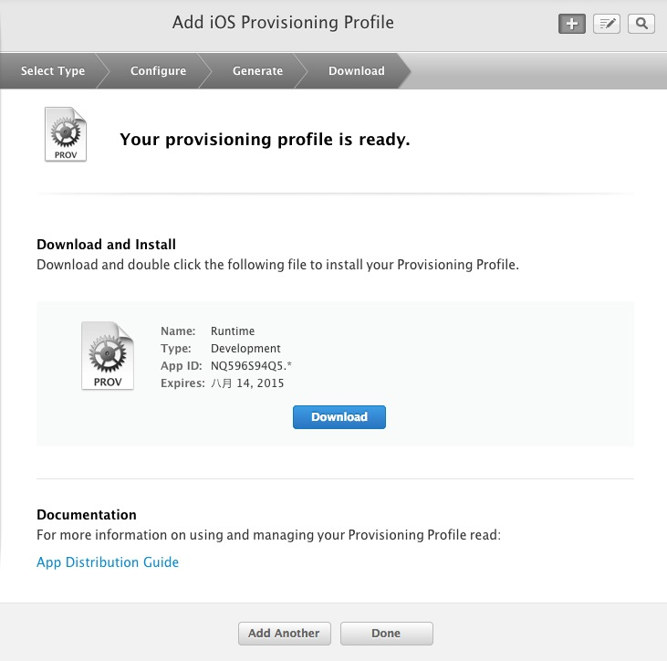

#####Now we need to import the provisioning file into Mac, so that it can authorize creating an ipa of distribution version 
#####There are two ways to import. First is to use the account system that comes with Xcode.

#####Open Xcode, click the "preference" option in the Xcode drop-down menu and choose "Accounts" in the pop-up page. If you are not logged in with your developer account, click the plus button at the left and right bottom, choose Add App ID , and then log into your developer account. After the login, click “View Details” at the right bottom.
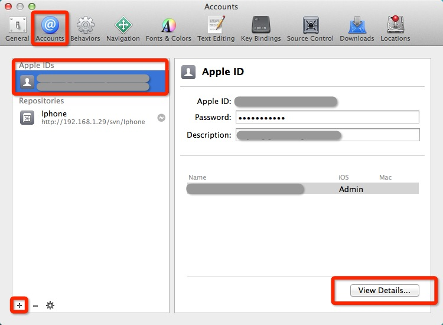

#####After you click View Details, detailed information about this account's certificate and description file will pop up; if the Provisioning Profiles list is empty or does not contain the description file that we created earlier, click on the refresh button at the left bottom and automatically the description file that matches current certificate would be automatically imported.

#####The second is to use the [iPhone configuration utility tool](http://support.apple.com/kb/DL1465?viewlocale=zh_CN&locale=zh_CN): we just need to manually download the generated description files onto Mac, then open the iPhone configuration utility tool and drag the description file into it, so it's imported into Mac now.

#####Now we are done with the creating and importing process of the description file.

## 7. Use the Package to IPA for iOS to compile and pack an IPA that can be used for real device debugging

#####In Code IDE, right click the ipa project that you want to pack and publish, choose the Pakcage to IPA for iOS option under "Cocos Tools" menu.
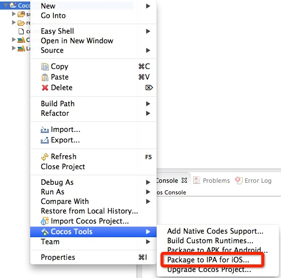

#####If the current project has never added an additional source yet, you will be prompted to add one, click Yes to do so (if the project has one already, skip this step)

#####In the pop-up “additional native source wizard” page， make sure that the iOS Bundle Identifier at the bottom matches the App ID we created; click Generate to generate source and be patient till it is done.

#####Native code added successfully. Click close.
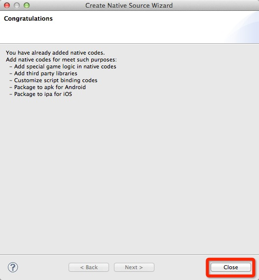

#####It will switch to our “Pakcage to IPA for iOS generated wizard page；” make sure the certificate and packaged Target is correct, then click Generate to start generating a publishable ipa.
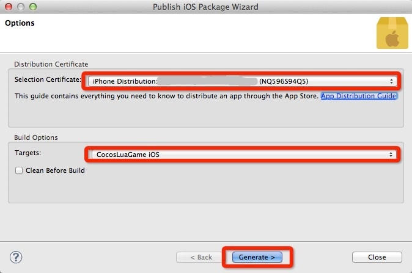

#####The ipa generating process would take 5-15 minutes, depending on the machine; please be patient.
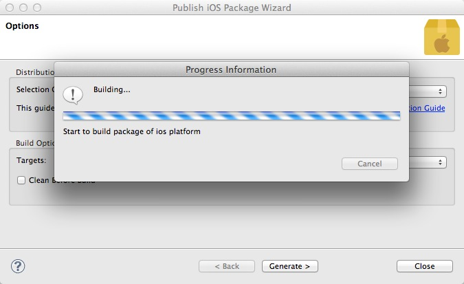

#####If generated successfully, it'll notify you where the ipa is saved; if fails, please refer to the log Console output and check for errors
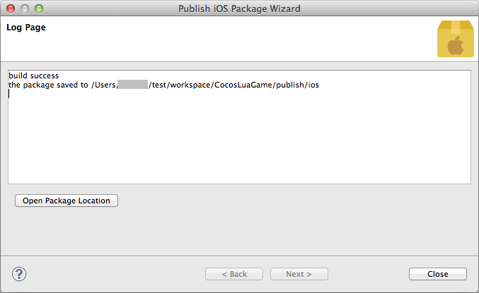

## 7. Install and run the distribution ipa

#####First thing we need to know is that after the ipa of distribution version is packed successfully, we can not install and debug directly;instead, we need to submit it to the App Store, download and install it after it is approved by the App Store.