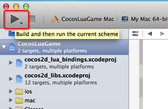

How to debug the framework cpp code
=========================
---
Before Cocos Code IDE 1.0.0-RC1, many users circumvented debuged the framework cpp code, because Cocos Code IDE supports Lua / JavaScipt only, and started and terminated runtime automatically. 

When you install Cocos Code IDE 1.0.0-RC1, you will notice **Remote Debug** radio group in **Debug Configurations** page that didn't exist before. Using this new feature, you can debug C++ with Lua / Javascript side-by-side simultaneously from Cocos Code IDE and XCode / Visual Studio.

Debug framework cpp is an advanced feature, I'am assuming you have mastered the basics. If not, please refer to [How to Debug Cocos2d-x Lua Game Using Code IDE][How to Debug Cocos2d-x Lua Game Using Code IDE] and [How to Debug Cocos2d-x JS Game Using Code IDE][How to Debug Cocos2d-x JS Game Using Code IDE]

## Key Steps
---
The basic principle is:Cocos Code IDE debug scripting logic, XCode / Visual Studio debug framework cpp code.

+ XCode / Visual Studio begin to debug runtime project
+ Runtime enter `waiting for debugging connect` page with blue background
+ Cocos Code IDE connect to runtime and notify runtime to start script
+ Cpp breakpoints will be triggered in XCode / Visual Studio and scripts breakpoints will be triggered in Cocos Code IDE.

## Debug Mac OSX runtime
This is a step-by-step guide for debugging Mac OSX lua runtime, other platforms and JavaScipt are similar, I will only point out the differences.

+ If you haven't added C++ code for this project, you need: right click on project, Cocos Tools->Add Native Codes Support...
+ Open project with XCode by double clicking `frameworks/runtime-src/proj.ios_mac/CocosLuaGame.xcodeproj`
+ Add C++ breakpoint at `Texture2D * TextureCache::addImage(const std::string &path)`
+ 
+ Switch the target to `CocosLuaGame Mac`
+ Click **Run** button to debug runtime. 
+ 
+ It would probably take several minutes to build project. Then you'll see the waiting connect page with a blue background. 
+ Go back to Cocos Code IDE, open “Debug Configurations” page by clicking **Debug Configurations** button on toolbars
+ 
+ Check **Remote Debug** radio button
+ Select "Mac" platfrom
+ Enter "127.0.0.1" into the **Target IP** and select "127.0.0.1" on the **Host IP**
+ 
+ Then click the **Debug** button

## Debug iOS runtime
The differences between iOS and Mac OSX are:

+ Switch the target to `CocosLuaGame iOS`, if you want to debug on iOS device, please prepare a Developer Certificates by yourself.
+ Select "iOS" platform

## Debug Win32 runtime
The differences between Win32 and Mac OSX are:

+ Open project with Visual Studio by double clicking `frameworks/runtime-src/proj.win32/CocosLuaGame.sln`
+ Press `F5` to debug runtime directly
+ Select "Win32" platfrom

## Debug Android runtime
In principle, you can also debug java and cpp in ADT Bundle, but the process is more complex, any document sharing is welcomed!

The only difference in Cocos Code IDE is: Select "Android" platform

[How to Debug Cocos2d-x Lua Game Using Code IDE]: http://www.cocos2d-x.org/wiki/How_to_Debug_Cocos2d-x_Lua_Game_Using_Code_IDE
[How to Debug Cocos2d-x JS Game Using Code IDE]:http://www.cocos2d-x.org/wiki/How_to_Debug_Cocos2d-x_JS_Game_Using_Code_IDE

