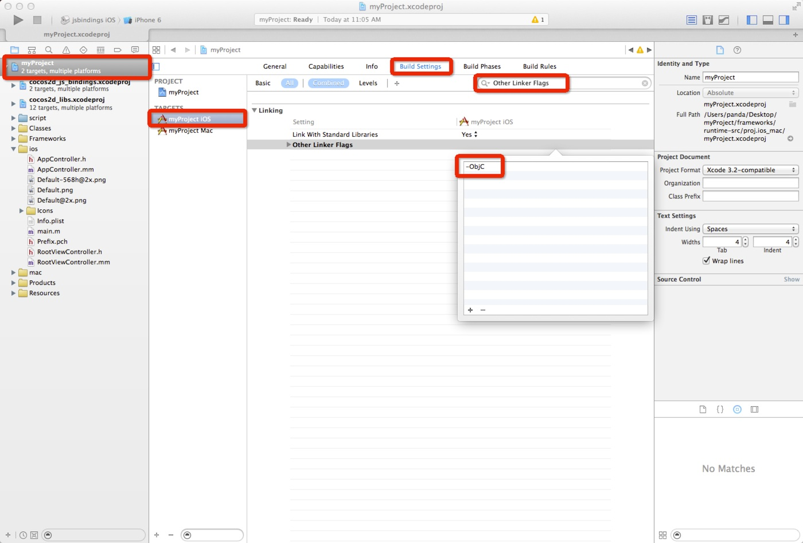
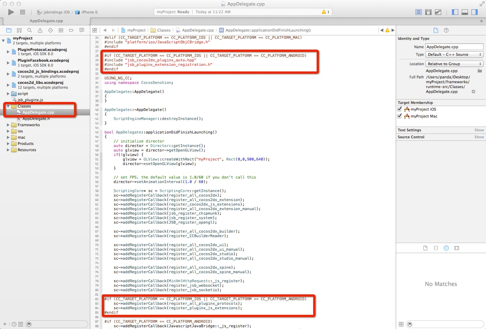

#iOS平台上如何配置Facebook平台集成

这篇文当将展示如何在iOS中快速得使用Cocos2d-JS的Facebook平台支持。

## 创建你的Facebook应用

请参考Facebook官方文档[Step 3. Obtain a Facebook App ID - Getting Started with the Facebook iOS SDK](http://developers.facebook.com/docs/ios/getting-started/#appid)来创建应用并配置iOS开发环境。

## 在工程中配置Facebook iOS SDK（同样参考Facebook官方文档）

**Step1**: 打开你创建好的iOS工程（假设你新建的工程叫做myProject，下同），你可以在`myProject/frameworks/runtime-src/proj.ios_mac/`路径下找到你新建的iOS工程。

**Step2**: 点击工程，`target`->`myProject IOS`->`Build Phases`->`Link Binary With Libraries`。点击`+`将弹出添加子窗口，点击子窗口中的`Add Other...`按钮。找到`myProject/frameworks/js-bindings/cocos2d-x/plugin/plugins/proj.ios/sdk/`路径下的FacebookSDK.framework并添加。


**Step3**: 参考Facebook官方文档：[Step 4: Configure your Xcode Project - Getting Started with the Facebook iOS SDK](http://developers.facebook.com/docs/ios/getting-started/#configure)，在Xcode工程下ios的Info.plist文件中添加你的Facebook应用的`FacebookAppID`，`FacebookDisplayName`，`URL types`，具体格式参考图片。


**Step4**: 打开`myProject`工程中的`myProject iOS`目标，打开`Build Settings`页面，然后搜索`Other Linker Flags`，并在其中添加`-ObjC`链接标志。

	

**Step5**: 找到`ios/AppController.mm`，并在当中加入Facebook iOS SDK需要的代码：

- 引入头文件，

	```
	#import <FacebookSDK/FacebookSDK.h>
	```

- 在`@implementation`中添加如下方法

	```
	- (BOOL)application:(UIApplication *)application openURL:(NSURL *)url sourceApplication:(NSString *)sourceApplication annotation:(id)annotation
	{
	    return [FBSession.activeSession handleOpenURL:url];
	}
	```

- 在`applicationDidBecomeActive:`方法中添插入`[FBAppCall handleDidBecomeActive];`

	```
	- (void)applicationDidBecomeActive:(UIApplication *)application {
	    [FBAppCall handleDidBecomeActive];
	    cocos2d::Director::getInstance()->resume();
	}
	```

## 在工程中添加Plugin-x和PluginFacebook的工程

因为Facebook平台支持对Plugin-x的依赖，你首先需要添加Plugin-x的工程：

**Step1**: 右键点击myProject工程，点击`addFiles to "myProject"`或者直接拖拽`myProject/frameworks/js-bindings/cocos2d-x/plugin/protocols/proj.ios/PluginProtocol.xcodeproj`的工程到"myProject"下。

**Step2**: 右键点击myProject工程，点击`addFiles to "myProject"`或者直接拖拽`myProject/frameworks/js-bindings/cocos2d-x/plugin/plugins/facebook/proj.ios/PluginFacebook.xcodeproj`的工程到`myProject`下。

**Step3**: 点击工程，`target`->`myProject IOS`->`Build Phases`，在`Target Dependencies`中点加号添加`PluginProtocol`和`PluginFacebook`，并在`Link Binary With Libraries`中添加`libPluginProtocol.a`和 `libPluginFacebook.a`。


## 添加Plugin-x的JSB绑定代码

在上面这些步骤之后，你现在就可以使用FacebookAgent类了，它包装了所有Facebook Integration的C++层API。为了这些API能够在Javascript层暴露出来，还有几个步骤要做，你需要在工程中包含Javascript绑定代码并将绑定代码注册到SpiderMonkey中。

**Step1**: 添加jsb_pluginx.js (`myProject/frameworks/js-bindings/cocos2d-x/plugin/jsbindings/script`目录下) 到`myProject`工程中，并确保它在`Build Phases`的`Copy Bundle Resources`列表中.


**Step2**: 找到Classes文件夹，并在`AppDelegate.cpp`文件中加入与Plugin-x相关的头文件，在此你需要加入两个头文件，`jsb_cocos2dx_pluginx_auto.hpp`和`jsb_pluginx_extension_registration.h` 代码如下所示：

    ```
	#if (CC_TARGET_PLATFORM == CC_PLATFORM_IOS || CC_TARGET_PLATFORM == CC_PLATFORM_ANDROID)
		#include "jsb_cocos2dx_pluginx_auto.hpp"
		#include "jsb_pluginx_extension_registration.h"
	#endif
    ```

**Step3**: 同样的，在`AppDelegate.cpp`的`AppDelegate::applicationDidFinishLaunching`函数中添加绑定函数的注册，如下所示（请注意代码添加的位置）：

    ```
    bool AppDelegate::applicationDidFinishLaunching()
	{
	    ...

	    ScriptingCore* sc = ScriptingCore::getInstance();

	    ...

	    // Add these lines before sc->start()
		#if (CC_TARGET_PLATFORM == CC_PLATFORM_IOS || CC_TARGET_PLATFORM == CC_PLATFORM_ANDROID)
			sc->addRegisterCallback(register_all_pluginx_protocols);
			sc->addRegisterCallback(register_pluginx_js_extensions);
		#endif

		sc->start();    
	    
	    ...

	    return true;
	}
    ```



自此，你的Plugin-x工程引入就做完了。

如果你想了解更多Plugin-x的配置，请参考[Plugin-x架构](http://www.cocos2d-x.org/docs/manual/framework/html5/jsb/plugin-x/plugin-x-architecture/zh)和[如何使用Plugin-x iOS篇](link)。

## 如何使用Facebook API

- 请参考[Facebook API Reference for Cocos2d-JS](../api-reference/en.md)