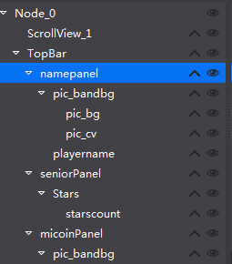

# 1.1.5 Animation panel

The animation panel is divided into five parts, scene graph, timeline, animation playback, animation editing, the animation curve.

#### Scene Graph

The scene graph contains all the widgets of the current file games uses such as buttons, maps, sound, particle and so on, It maps with widgets of the canvas. You can directly drag the widget from widgets panel to the scene graph will add the object (also appear in the canvas), the scene graph provides a way to visually adjust the structure of the widgets, through the scene graph, you can add, delete, adjust the widget render order, adjust parent-child hierarchies of the widgets.

You can also use the scene graph to hide a widget in the canvas, or lock if to prevent editing, but whether locked or hidden in the scene graph panel, only affect the display on canvas, the effect will not be output to the final game, if you need the effect to appear in the game, please modify the properties in property panel.

#### The parent-child hierarchies

Cocos Studio uses the concept of parent-child hierarchies, so that any object can become a child of another object, to establish the relationship move the object onto its parent object, will move with the parent. 
Note: the opacity and color tint properties will not be inherited from the parent object.

#### Timeline

Cocos Studio provides an animation timeline, in the timeline you can add key frames, the editor will automatically add the animation curve between two frame, to achieve animation effects. You can adjust the animation effects by selecting the animation curve to adjust the tweening, make your animation more vivid.

#### Animation playback tool

The animation control tool can control the current timeline, play the animation, adjust framerate or jump to a specific frame.

#### Animation editing tool

The animation editing tool provides editing function for animation:

Add frame: add a key frame on the timeline when you click the selected position.

Automatic recording frame: what you do after the click will be recorded in the current frame, become the key frame, by modifying the widget property in different frames, you can create rich and colorful animation effects

Orion Skin: use the current frame as the foundation, the frame around the current frame show up through to assist with animation editing.

